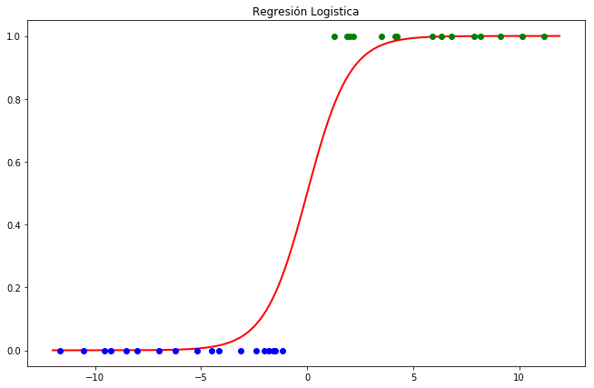

La idea principal de los modelos lineales generalizados es poder realizar regresión con variables predictivas que no son continuas, en particular con una variable categórica.  Algunos problemas de este estilo puede ser cuando se quiere predecir que un suceso ocurra o no, puede ser para diagnosticar una enfermedad o saber si una persona esta empleada o no. En el caso particular de que solo se tengan dos categorías (Si/No) la regresión logística destaca del resto de modelos generalizados.

En el caso binario nuestra variable que queremos predecir $$Y_i\in\{0,1\}$$, nuestro problema se simplifica un poco debido a que nuestra tarea es estimar la probabilidad de que ocurra el evento, es decir:

$$\pi_i=\mathbb{P}(Y_i=1)=\mathbb{E}(Y_i)$$ 

Una vez teniendo esta probabilidad podemos decidir si el evento va a ocurrir o no. Si suponemos que la ocurrencia del evento tiene una dependencia lineal de nuestros datos observados, tendríamos una relación de la siguiente manera: 

$$\pi_i=\beta_0+\sum_{i=1}^{n}\beta_i x_i$$ 

Sin embargo, tendríamos la limitante de que tanto las variables $$x = (x_1,...,x_n)$$ y los parámetros $$\beta = (\beta_0,...,\beta_n)$$ tendrían que estar entre 0 y 1 para que el termino de la izquierda tenga sentido decir que es una probabilidad.

Entonces necesitamos una función $$h\in[0,1]$$ que nos transforme el termino lineal en una probabilidad.

$$\pi_i=h(\beta_0+\sum_{i=1}^{n}\beta_i x_i)$$

En el caso de una regresión logística se propone $$h$$ como la función de distribución de una variable aleatoria $$\eta\sim  \log(U)-\log(1-U)$$ donde $$U$$ es una variable aleatoria Uniforme $$[0,1]$$:

$$\mathbb{P}(\eta\leq t)=h(t)=\frac{e^t}{1+e^{t}}=\frac{1}{1+e^{-t}}$$

Visto de otra manera

$$\log(\frac{\pi_i}{1+\pi_i})=\beta_0+\sum_{i=1}^{n}\beta_i x_i$$

Este modelo asume que $$Y_i$$ es una variable Bernulli con media $$\pi_i$$. Los parámetros $$\beta = (\beta_0,...,\beta_n)$$ son estimados por máxima verosimilitud, usando la función de máxima verosimilitud de las variables Bernulli:

$$\mathcal{L}(\beta)=\prod_{i=1}^{n}\pi_i^{Y_i}(1-\pi_i)^{1-Y_i}$$

Entonces $$\hat{\beta}=\text{argmax }\mathcal{L}(\beta)$$. No existe una forma cerrada para poder calcular $$\hat{\beta}$$ para ello usamos el siguiente algoritmo:

Escogemos valores arbitrarios iniciales de $$\hat{\beta}$$ y calculamos $$\pi_i=\frac{1}{1+\exp({-\beta_0-\sum_{i=1}^{n}\beta_i x_i})}$$. Seguimos los siguientes 3 pasos hasta que $$\hat{\beta}$$ converja:

Sea $$Z_i=\log(\frac{\pi_i}{1+\pi_i})+\frac{Y_i-\pi_i}{\pi_i(1-\pi_i)}\quad\quad i=1,2,...,n$$
Fijamos el nuevo valor de $$\hat\beta$$ como $$\hat\beta = (X^T W X)^{-1}X^TWZ$$ donde $$W$$ es una matriz diagonal con $$w_{ii}=\pi_i(1-\pi_i)$$
Volvemos a calcular $$\pi_i$$ usando la nueva $$\beta$$.

Este método es usado por la popular libreria de cómputo estadístico Scikit-Learn para python:

```python
from sklearn.linear_model import LogisticRegression
x = ... #Variables Predictivas 
y = ... #Variables Objetivo
model = LogisticRegression(solver ="newton-cg") #Indicamos que queremos usara el método de Newton
model.fit(x,y) #Realiza la estimación de los parámetros
model.get_params() #Te regresa el valor de los parámetros
model.score(x,y) #Calcula el error cuadrático medio de los datos
model.predict(z) #Predice el valor que tendrían las y's si los datos fueran Z, utilizando los parámetros estimados. 
model.predict_proba(z) #Calcula la función logística con los datos Z.
```

Finalmente, debemos saber que el poder predictivo de una regresión logística puede ser mejorado haciendo algún tratamiento a los datos con los que se quiere predecir.

Gráficamente, podemos poner los datos observados contra la forma de la función $$h$$, pintamos de color diferente los datos tales que $$Y_i=1$$ ó $$Y_i=0$$.



## Referencias
- Larry Wasserman, All of Nonparemetric Statistics. First Edition, Springer 2006
